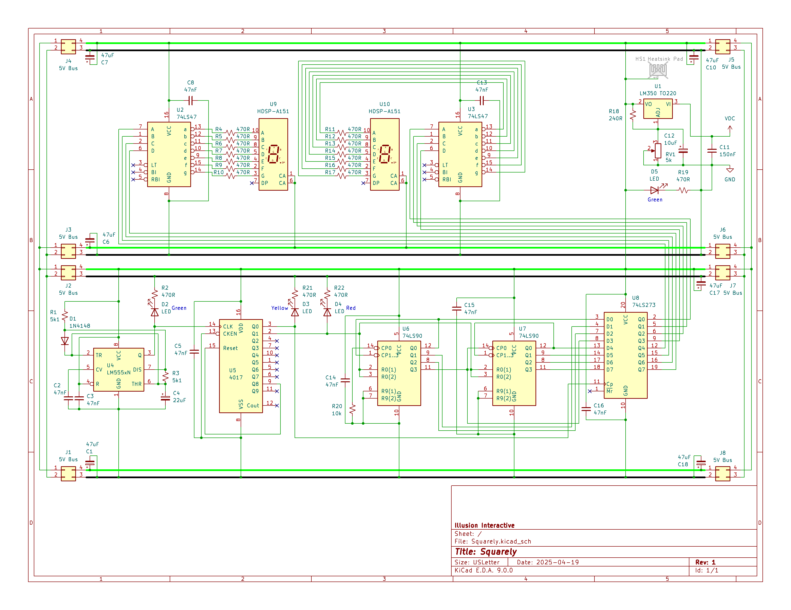

# 🛠️ Squarely

A super low-frequency square wave counter originally built back in high school, designed for basic signal counting and hands-on hardware experimentation. It uses classic 74-series logic to drive a multi-digit display and can be expanded or tuned for various applications.

Reflecting on the original design, here are a few areas worth improving:

- Replace discrete resistors with a **resistor bank** — cleaner layout and easier substitutions
- Adjust the **555 timer's RC values** to support higher input frequencies (up to low MHz)
- Add a **third digit** to extend the count range
- Use logic chips from the same **family (e.g., 74HCXX)** for consistent behavior and performance
- Pull unused inputs **high or low** to prevent erratic logic states
- Support an **external clock input** via pin 14 (CP0) of the first 74XX90 counter for easier integration or testing

---

---

## 🔹 General Notes

- **Input Signal Options**:
  - Internal 555 timer (adjustable via RC timing)
  - **External square wave source** (connect to pin 14 / CP0 of the first 74XX90)

- **Display**:
  - 2-digit 7-segment display (expandable)
  - Driven by chained 74XX90 decade counters and 74XX47 BCD-to-7-segment drivers
  - A D flip-flop latches the output from the counters to the display drivers

- **Modularity**:
  - RC timing is easily adjustable for frequency testing
  - Logic chips can be swapped to experiment with propagation delays, power consumption, or chip families
